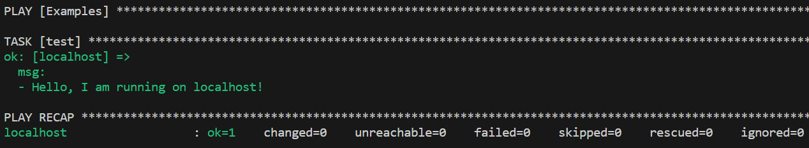

# Introduction to Ansible
:warning: WiP
:-


Intention for this repository is to provide a basic introduction to Ansible while also providing a usable base structure with examples.  
The goal is not to cover everything Ansible is capable of but enough to make practical use of it.

:notebook: NOTE
:-
The examples are tested on a `Debian` based System.  
Be aware of possible differences on other Systems.


## Table of Content
- [What is Ansible?](#what-is-ansible)
- [Installation](#installation)
  - [Directory structure](#directory-structure)
  - [SSH Configuration](#ssh-config)
    - [SSH-Agent](#ssh-agent)
    - [TPM 2.0](#tpm-20)
  - [Prepare target Systems](#prepare-target-systems)
  - [Ansible Configuration Settings](#ansible-configuration-settings)
- [Structure](#structure)
  - [Inventory](#inventory)
  - [Playbook](#playbook)
  - [Tasks](#tasks)
  - [Handlers](#handlers)
  - [Roles](#roles)
  - [Vars](#vars)
  - [Conditionals and Loops](#conditionals-and-loops)
  - [Grouping and Error handling](#grouping-and-error-handling)
  - [Jinja2 Templates](#jinja2-templates)
  - [Vault](#vault)
- [Extras](#extras)
  - [Ansible Tower](#ansible-tower)
  - [Semaphore UI](#semaphore-ui)
  - [Pull Mode](#pull-mode)
  - [Execution Environment](#execution-environment)
- [Tips](#tips)


## What is Ansible?
Ansible is an IT automation tool. It can be used to Configure and Deploy Systems and Software.
It can be viewed, in a classical way, as a collection of installer script to ensure a System reaches a desired state of operation, but with the intend of making these scripts reusable on multiple Systems while making it possible to re-run the same scripts on a System multiple times without making changes if the desired state has already been reached ([idempotent](https://docs.ansible.com/ansible/latest/reference_appendices/glossary.html#term-Idempotency)).   
Through `SSH` it connects to Systems and Devices and manages them based on `YAML` and `Python` Code.  
Because of this Ansible is essentially agent-less. The target Systems only need to be able to accept SSH connections (e.g. openssh-server).  
It also has decent [Documentation](https://docs.ansible.com/ansible/latest/).  
Key term definitions can be found [here](https://docs.ansible.com/ansible/latest/reference_appendices/glossary.html).


## Installation
Install Ansible on your System:
```bash
sudo apt update
sudo apt install -y openssh-client python3 python3-pip ansible
pip install --user --upgrade pip
pip install --user --upgrade ansible
```
I always recommend to update `ansible` via `pip` to the latest version, this way you will be warned in advance about `deprecations` when using it.  
Also, **new features**.

Default search paths are:
- `~/.ansible/`
- `/usr/share/ansible/`
- `/etc/ansible/`
But it is also possible to use a different path, like we will be this repository structure.

### Directory structure
---
There are many ways in how to build the directory structure for Ansible.  
You can find additional examples [here](https://docs.ansible.com/ansible/latest/tips_tricks/sample_setup.html).  
The structure within this repository is just what worked best for me.

- In the base directory is the Ansible Configuration file `ansible.cfg` and the so-called playbooks `*.yml`/`*.yaml` (more later).
- The `inventory` directory contains one or multiple inventory files (all files are read automatically) that contain hosts that can be combined by groups.
- `host_vars` and `group_vars` can contain files named after hots or groups as they are defined in the inventories, they are matched automatically.
- In the `roles` directory are multiple roles that each contain individual tasks and generic files, variables etc. to fulfill those tasks.
- The `files` directory is not Ansible related, I just found it useful to have a separate directory for files that I want to copy to multiple target Systems (e.g. public SSH-Keys).

It is possible to have an own directory for the `playbooks` but you would have to define the path for the roles in the `ansible.cfg` using `roles_path`, because Ansible assumes that `roles` are stored in a sub-directory where the playbooks are.


### SSH Configuration
---
Ansible is capable of reading the `~/.ssh/config`.  
Through this you con't have to manage any `hosts` file.  
Just add the Systems that you would like to mange with Ansible into the configuration like:
```bash
Host sample1
  HostName target-server.com
  User user1
  IdentityFile ~/.ssh/key_file_name1

Host sample2
  HostName 172.1.0.5
  User user2
  PreferredAuthentications password
  

Host sample3
  HostName 10.1.0.5
  IdentityFile ~/.ssh/key_file_name3
  ProxyJump jump-host

Host *
  User user_default
  Port 22
  PreferredAuthentications publickey
  IdentityFile ~/.ssh/default_key_file
  IdentitiesOnly yes
  ForwardAgent no
  UseRoaming no
  SendEnv LANG LC_*
  Compression yes
```
It is recommended to avoid always reusing the same SSH-Key and also having one without passphrase.  
If having individual SSH-Keys and passphrases for each System is too tedious consider having one SSH-Key for a group of Systems or one for each customer or whatever fits your infrastructure and requirements.
```bash
# Generating SSH Key
ssh-keygen -t ed25519 -a 64 -b 4096 -C "Ansible SSH Key" -f ~/.ssh/ansible_key
```

Here are some great talks about SSH and how it can be used in a good way:  
[Talk about SSH by Leyrer Part1 (german)](https://media.ccc.de/v/gpn20-8-besser-leben-mit-ssh)  
[Talk about SSH by Leyrer Part2 (german)](https://media.ccc.de/v/gpn21-28-noch-besser-leben-mit-ssh#t=829)

[Talk about SSH by Leyrer (english)](https://media.ccc.de/v/mch2022-170-ssh-configuration-intermediate-level)


Some are saying that to manage Windows Systems `winrm`(Windows Remote Management) can/should be used.  
I highly discourage you to do that, as you can simply use SSH.  
Also the example scripts that you may find online or by Microsoft to enable `winrm` usually aren't meant for production and disable security features.


#### SSH-Agent
To remove the need to always insert the passphrase for the SSH-Keys, the `ssh-agent` command can be used.  
For some reason the SSH-Agent requires to be started for each new terminal session.  
This can be circumvented by auto-loading the SSH-Agent env vars on each terminal session.  
I am adding it to `/etc/bash_completion.d` because avoiding adding anything and everything to `.bashrc` should be preferred, also having individual files makes cleanup easier.
```bash
echo 'eval "$(ssh-agent -s)" > /dev/null' | sudo tee /etc/bash_completion.d/ssh-agent.bash_completion > /dev/null
```
Alternatively creating a `.bashrc.d` directory in your home is also recommended:
```bash
mkdir ~/.bashrc.d
chmod 700 ~/.bashrc.d

sudo tee -a ~/.bashrc > /dev/null <<EOT
for file in ~/.bashrc.d/*.bashrc;
do
source “\$file”
done
EOT

echo 'eval "$(ssh-agent -s)" > /dev/null' | sudo tee ~/.bashrc.d/ssh-agent.bashrc > /dev/null
chmod +x ~/.bashrc.d/*.bashrc
```
Now you can place files inside of that directory as `<filename>.bashrc`, but you may have to add execution permission to each file.
```bash
chmod +x ~/.bashrc.d/*.bashrc
```

Now you can load the public key into your SSH-Agent which requires you to only enter the passphrase ones for as long as the terminal session is open.
```bash
ssh-add ~/.ssh/key_file_name
```

#### TPM 2.0
It is possible to have SSH-keys in the TPM 2.0 Chip, but I haven't used that yet.  
It is well explained here:
[Talk about SSH by Leyrer Part2 (german)](https://media.ccc.de/v/gpn21-28-noch-besser-leben-mit-ssh#t=829)


### Prepare target Systems
---
Linux (Debian):
```bash
sudo apt update
sudo apt install -y openssh-server python3
```

Windows Powershell:
```powershell
Get-WindowsCapability -Online | Where-Object Name -like 'OpenSSH*' -OutVariable cmdOutput
# should return two entries
# OpenSSH.Client~~~~0.0.1.0
# OpenSSH.Server~~~~0.0.1.0

Add-WindowsCapability -Online -Name $cmdOutput[0].name
Add-WindowsCapability -Online -Name $cmdOutput[1].name

Start-Service sshd

# Add SSH to autostart
Set-Service -Name sshd -StartupType 'Automatic'
```

After the OpenSSH Server is installed add the SSH-Keys from the System where Ansible will be run from to the target System.
```bash
# From Ansible System
ssh-copy-id -i ~/.ssh/key_file_name <target_system>
```
Also consider disabling the option to allow login via SSH using Password (after you made sure login via SSH-Key works):
```bash
#/etc/ssh/sshd_config
PasswordAuthentication no
```
```bash
systemctl restart sshd
```


### Ansible Configuration Settings
---
[List of settings](https://docs.ansible.com/ansible/latest/reference_appendices/config.html)  
The `ansible.cfg` allows you to configure Ansible to your needs.
E.g.:  
- add log directory
- change directories for playbooks, inventories, etc.
- set defaults
- ...

To generate a fully commented-out example `ansible.cfg` run:
```bash
ansible-config init --disabled > ansible.cfg
```

Or to also include existing plugins:
```bash
ansible-config init --disabled -t all > ansible.cfg
```

For this repository I have preset two settings:
First the path for the directory containing the inventory files. This one is required, otherwise Ansible won't find the files, sadly this also means you have to be in the directory where all the Ansible files and dirs are located ot it won't work (except if you change the config to the full path).  
Secondly the option to make the terminal output formatted in `YAML`, which is optional and can be removed if needed.


### Test
---
Download this repository and switch into its directory.  
Run the first example (Connections to localhost don't require SSH):
```bash
ansible-playbook example_01.yml
```



## Structure

### Inventory
---
[Inventory building](https://docs.ansible.com/ansible/latest/inventory_guide/intro_inventory.html)

The inventory which contains a structure of your host, groups and if desired variables and connection settings can be built in multiple ways.
The most common ones are either as `YAML` or `ini`.
As there is not much of a difference, except for how the files are structured, I will only go over the `YAML` structure for now.

```YAML
---
all:
  children:
    internal:
      children:
        ansible_vm:
          hosts:
            local_system:
              ansible_connection: local
              host_test_var: test
          vars:
            group_test_var: test
hosts:
  ungrouped_host:
...

```
- The `---` and `...` mark the beginning and end of a `YAML` file and are used in all of them. The `...` is optional but I add anyway.
- Under `all` you place all your hosts and groups, if needed it is also possible to define hosts separately.
- With `childern:`you can define sub-groups to separate `hosts` by type, task, service, cluster or however you want
- `hosts` contains all Systems for a group or sub-group.
- You can define any variable or [connection](https://docs.ansible.com/ansible/latest/inventory_guide/intro_inventory.html#connecting-to-hosts-behavioral-inventory-parameters) option either directly below a specific System or for a whole group or sub-group.

When running a `playbook` you can specify with `-i <path>` which inventory should be used.
With my configuration any `YAML` or `ini` will be automatically loaded from the `inventory/` directory.

When building your inventory be careful with naming a group, because groups with the same name will be grouped together when called directly. Whis is also known as `metagroup`  
This can be seen when running the following example:
```bash
ansible-playbook example_host_grouping.yml
```
In the recap you will see two host because both are in the sub-group `docker_host` even though they are in separate different sub-groups.  
Because of this I recommend using unique names for a group like adding a suffix or prefix to the name of the parent group or something like `prod_` and `staging_`.

But you can also use this function to build your inventory like this:
```yaml
leafs:
  hosts:
    leaf01:
      ansible_host: 192.0.2.100
    leaf02:
      ansible_host: 192.0.2.110

spines:
  hosts:
    spine01:
      ansible_host: 192.0.2.120
    spine02:
      ansible_host: 192.0.2.130

network:
  children:
    leafs:
    spines:

webservers:
  hosts:
    webserver01:
      ansible_host: 192.0.2.140
    webserver02:
      ansible_host: 192.0.2.150

datacenter:
  children:
    network:
    webservers:
```
This example contains a metagroup `network` that includes all network devices and a metagroup `datacenter` that includes the `network` and `webservers` groups.

```bash
ansible-playbook example_inventory.yml
```

### Playbook
---
[Playbook guide](https://docs.ansible.com/ansible/latest/playbook_guide/index.html)  
[Official examples](https://github.com/ansible/ansible-examples)

[List of playbook keywords](https://docs.ansible.com/ansible/latest/reference_appendices/playbooks_keywords.html)

A `playbook` is the starting point similar a setup script that is executed.  
In a `playbook` you define a `group` from the inventory which will be targeted by its content, using the `hosts` variable.
```yaml
---
- hosts: linux_server
...

```
It is also possible to exclude one or multiple sub-groups:
```yaml
---
- hosts: linux_server !webservers
...

```
And wildcards:
```yaml
---
- hosts: linux_*
...

```

It can also contain connection settings to override those in the inventory.  
You can also define settings like `become:` (default: false) to define if everything should be run with privilege escalation (sudo) or `gather_facts:` (default: true) to collect [facts](https://docs.ansible.com/ansible/latest/playbook_guide/playbooks_vars_facts.html#id3) which contain information about the target System like operating system, IP and more, or `serial:`to define how many Systems should be configured at the same time and many more settings.  
Additionally you can define additional `vars` that may also contain or overwrite connection variables like `ansible_user`, `ansible_host` or `ansible_port`.
It is also possible to define variables under `vars_prompt:` to ask for input for specific variables that you don't want to write down in any file.

Important to note that `become: true` is handled differently when used at the beginning of a `playbook` compared to when used in a specific `task` or `role`.  
When used at the beginning of a `playbook` Ansible will change the user on the target host to `root`, while when used in e.g. a `task` it is similar to using `sudo`.  
This is a majorly change that should be taken into account when e.g.: using `ansible_user_id`.  
Using `become: true` in the heading of a `playbook` should be avoided if possible as running everything as `root` also may create undesired security issues.


After the first 'configuration' blog it is possible to define one or all of the following sections:
- pre_tasks: list of tasks executed before roles
- roles: list of roles to be imported
- tasks: list of tasks executed after roles
- post_tasks: list of tasks executed after tasks section
- handlers: list of tasks, but ony run when a task contains the `notify` keyword and has the state changed.

Futhermore you can define multiple of these sets in one `playbook`:
```yaml
---
- name: Configure Linux server
  hosts: linux_server
  tasks: ...

- name: Configure Windows server
  hosts: windows_server
  tasks: ...
...

```

A `playbook` is run with the command:
```bash
ansible-playbook <playbook_name>.yml
```
With `ansible-playbook --help` you can also check out its multiple additional options.


```bash
ansinle-playbook example_playbook.yml
```
See how in this example `windows_docker` is in the list of targeted host because of the `docker_host` group.  
So again, be careful with how you name your groups.

### Tasks
---
A task is a singular action that should be run. It can be anything from a simple console command, to disk formatting, network configuration and more. Every possible action is grouped in `namespace` and a [collection](https://docs.ansible.com/ansible/latest/collections/index.html) reaching from [builtin](https://docs.ansible.com/ansible/latest/collections/ansible/builtin/index.html#plugins-in-ansible-builtin) to [community managed](https://docs.ansible.com/ansible/latest/collections/community/index.html).  
There is also the [ansible-galaxy](https://galaxy.ansible.com/ui/) which contains even more collections outside of the official documentation.

| Namespace | Collection | Module |
| --------- | ---------- | ------ |
| ansible   | builtin    | debug  |
| community | general    | sudoers|
| kubernetes| core       | helm   |

The `example_tasks.yml` file contains basic examples in how tasks are structured.
```bash
ansible-playbook example_tasks.yml
```
A task can additional to it's action contain where, when and with what privileges it should run and more.

Each task is at the end like a `Python` module defined in a `collection` within a `namespace`.  
This is also known as [Fully Qualified Collection Name (FQCN)](https://docs.ansible.com/ansible/latest/reference_appendices/glossary.html#term-Fully-Qualified-Collection-Name-FQCN).  
While it is possible to only use the `module` name (like `debug`) it is highly recommended to use the `FQCN` to ensure you don't accidentally run a `module` from a different `collection` or `namespace` that has the same name.


### Handlers
---
[Handlers guide](https://docs.ansible.com/ansible/latest/playbook_guide/playbooks_handlers.html)

Handlers are singular tasks that only run when `notified` by a `task` and only when that `task` has the status `changed`.  
This can be useful for example when a change in configuration request the restart of a service but the service shouldn't be restarted when it is not needed.

```yaml
- name: Update package cache
  ansible.builtin.package:
    update_cache: true
      notify: handler1

- name: Update package cache
  ansible.builtin.package:
    update_cache: true
      notify:
        - handler1
        - handler2
```

Handlers are run in the order they are defined in the `handlers` section and not in the order of the `notify` section.  
handlers can have utilize the keyword `listen` so that multiple handlers can be grouped together.
```yaml
tasks:
  - name: Restart everything
    command: echo "this task will restart the web services"
    notify: "restart web services"

handlers:
  - name: Restart memcached
    service:
      name: memcached
      state: restarted
    listen: "restart web services"

  - name: Restart apache
    service:
      name: apache
      state: restarted
    listen: "restart web services"
```

By default, handlers run after all the tasks in a particular play have been completed. Notified handlers are executed automatically after each of the following sections, in the following order: pre_tasks, roles/tasks and post_tasks. This approach is efficient, because the handler only runs once, regardless of how many tasks notify it. For example, if multiple tasks update a configuration file and notify a handler to restart Apache, Ansible only bounces Apache once to avoid unnecessary restarts.
If you need handlers to run before the end of the play, add a task to flush them using the meta module, which executes Ansible actions:
```yaml
tasks:
  - name: Some tasks go here
    ansible.builtin.shell: ...

  - name: Flush handlers
    ansible.builtin.meta: flush_handlers

  - name: Some other tasks
    ansible.builtin.shell: ...
```
The `meta: flush_handlers` task triggers any handlers that have been notified at that point in the play.

Once handlers are executed, either automatically after each mentioned section or manually by the flush_handlers meta task, they can be notified and run again in later sections of the play.

Handlers from roles are not just contained in their roles but rather inserted into the global scope with all other handlers from a play. As such they can be used outside of the role they are defined in. It also means that their name can conflict with handlers from outside the role. To ensure that a handler from a role is notified as opposed to one from outside the role with the same name, notify the handler by using its name in the following form: role_name : handler_name.

Handlers notified within the roles section are automatically flushed at the end of the tasks section but before any tasks handlers.

:notebooke: Note
:-
Handlers can run `include_tasks`, `import_task` and meta module
Handlers can't run `include_role`, `import_role`, and meta module `flush_handlers`

The `example_handlers.yml` file contains basic examples for handlers.
```bash
ansible-playbook example_handlers.yml
```

### Roles
---
A [role](https://docs.ansible.com/ansible/latest/playbook_guide/playbooks_reuse_roles.html) can be viewed as a set of tasks and other things grouped together.  
It has a defined directory structure with eight main standard directories, but it is only required to include at least one of them. Directories not used can be omitted.
```bash
roles/
  example_role/           # this hierarchy represents a "role"
    defaults/       #
      main.yml      #  <-- default lower priority variables for this role
    tasks/          #
      main.yml      #  <-- tasks file can include smaller files if warranted
    handlers/       #
      main.yml      #  <-- handlers file
    files/          #
      bar.txt       #  <-- files for use with the copy resource
      foo.sh        #  <-- script files for use with the script resource
    templates/      #  <-- files for use with the template resource
      ntp.conf.j2   #  <------- templates end in .j2
    vars/           #
      main.yml      #  <-- variables associated with this role
    meta/           #
      main.yml      #  <-- role dependencies
    library/        # roles can also include custom modules
    module_utils/   # roles can also include custom module_utils
    lookup_plugins/ # or other types of plugins, like lookup in this case


  webtier/          # same kind of structure as "example_role" was above, done for the webtier role
  monitoring/       # ""
  fooapp/           # ""
```
Ansible looks for roles in the following locations:
- in collections (if you are using them)
- in a directory named `roles/`, relative to the playbook file
- in the configured `roles_path`. The default search path is `~/.ansible/roles:/usr/share/ansible/roles:/etc/ansible/roles`
- in the directory where the playbook file is located

Alternatively the full path can be provided when calling a role:
```yaml
---
- hosts: webservers
  roles:
    - role: '/path/to/my/roles/common'
...

```

You can use roles in three ways:
- At the play level with the `roles` option: This is the classic way of using roles in a play.
- At the tasks level with `include_role`: You can reuse roles dynamically anywhere in the `tasks` section of a play using `include_role`.
- At the tasks level with `import_role`: You can reuse roles statically anywhere in the `tasks` section of a play using `import_role`.


By default a role is only run once no matter how often it is defined in a playbook.  
There are two ways to circumvent this:
- Passing different variables to the role
- Within `meta/main.yml` of a role set `allow_duplicates: true`

There is also the [ansible-galaxy](https://galaxy.ansible.com/ui/) which contains even more roles.

```bash
ansible-playbook example_role.yml
```
Uncommenting `allow_duplicates: true` in `roles/example_role/meta/main.yml` will show the difference when passing different variables.


### Vars
---
[Using Variables](https://docs.ansible.com/ansible/latest/playbook_guide/playbooks_variables.html)

Variables can be bool, integer, string, list, dictionary and any combination of lists and dictionaries
```yaml
vars:
  int_var: 1
  string_var: fuu
  list_var_1: [ fuu, bar, 1 ]
  list_var_2:
    - fuu
    - bar
    - 1
  dict_var_1: { name: fuu, number: 2 }
  dict_var_2:
    name: fuu
    number: 1
  list_dict:
    - name: fuu
      number: 3
    - name: bar
      number: 4
  dict_list:
    names:
      - fuu
      - bar
    number: 5
```

There are also [Special Variables](https://docs.ansible.com/ansible/latest/reference_appendices/special_variables.html) and [Facts](https://docs.ansible.com/ansible/latest/playbook_guide/playbooks_vars_facts.html) that can be used as variables.  
These contain variables containing connection information, paths to ansible files/dirs, facts about a host like OS, IP Address und much more.

Variables can be defined and overwritten in multiple places, which results in a list of [Variable Precedence](https://docs.ansible.com/ansible/latest/playbook_guide/playbooks_variables.html#understanding-variable-precedence) from least to greatest (the last listed variables override all other variables):
1. role defaults (defined in role/defaults/main.yml) 1
2. inventory file or script group vars 2
3. inventory group_vars/all 3
4. playbook group_vars/all 3
5. inventory group_vars/* 3
6. playbook group_vars/* 3
7. inventory file or script host vars 2
8. inventory host_vars/* 3
9. playbook host_vars/* 3
10. host facts / cached set_facts 4
11. play vars
12. play vars_prompt
13. play vars_files
14. role vars (defined in role/vars/main.yml)
15. block vars (only for tasks in block)
16. task vars (only for the task)
17. include_vars
18. set_facts / registered vars
19. role (and include_role) params
20. include params
21. extra vars (for example, -e "user=my_user")(always win precedence)


To use variable, they can be referenced via double curly braces (Jinja2 syntax) `"{{ int_var }}"`.  
To create valid YAML syntax, usually the whole expression containing a variable needs to be quoted.  
This is usually not needed when used in a `when:` statement.


It is also possible to define [Custom Facts](https://docs.ansible.com/ansible/latest/playbook_guide/playbooks_vars_facts.html#facts-d-or-local-facts).  
They will be added automatically when running `gather_facts`, but they can also be loaded manually with optionally adding path using:
```yaml
tasks:
    - name: Filter and return only selected facts
      ansible.builtin.setup:
        filter:
          - 'ansible_local'
        fact_path: "{{ playbook_dir }}/facts.d"
```
The default path Ansible is looking for is `/etc/ansible/facts.d` but that can be changed in `ansible.cfg` with `fact_path=`.  
Custom facts need to be either in `JSON` or `INI` format.  
The content of the files under `facts.d` can be anything, just the return value needs to be correctly formatted.  
This allows to also run script files (`bash`, `python`, ...) that return e.g. `JSON` formatted `key/value` pairs.  
For that the scripts have to be executable with shebang (e.g.: `#!/usr/bin/env bash`) and proper permissions (e.g.: `chmod +x facts.d/date_time.fact`).

```bash
ansible-playbook  example_vars.yml
ansible-playbook  example_facts.yml
ansible-playbook  example_custom_facts.yml
ansible-playbook  example_query.yml
ansible-playbook  example_lookup.yml
ansible-playbook  example_vars_nested.yml
```


### Conditionals and Loops
---
Ansible allows to check for specific conditions before running a `task`, `role`, `block`, etc. using the `when` keyword.  
It can be used to check if some variable contains desired information, like if something is set to `true`, is a specific package installed, etc..  
`when` can either be a single line string or a multiline list.  
When stated with a list each part in that list is connected as if `and` is used.  
Conditions can be linked together with `and` and `or` keywords.
```bash
ansible-playbook  example_conditionals.yml
```


[Loops](https://docs.ansible.com/ansible/latest/playbook_guide/playbooks_loops.html) allows repetitive execution of a single task.  
This can be useful to e.g. install multiple packages, create multiple user, etc..
Most commonly loops are used to iterate over a list where each singular part is available with the `"{{ item }}` keyword.

```bash
ansible-playbook  example_loops.yml
```

Loops can be managed with the [loop_control](https://docs.ansible.com/ansible/latest/playbook_guide/playbooks_loops.html#adding-controls-to-loops) keyword.  
It allows to set a `label`which can be used to define the console output during the task run. This can be used  e.g. when iterating over list of dicts `"{{ item.name }}"`.  
Additionally it is possible to [extend](https://docs.ansible.com/ansible/latest/playbook_guide/playbooks_loops.html#extended-loop-variables) the loop information by setting `extended: true` in the `loop_control`, which adds the following information:
| Variable               | Description                                                                             |
| ---------------------- | --------------------------------------------------------------------------------------- |
| ansible_loop.allitems  | The list of all items in the loop                                                       |
| ansible_loop.index     | The current iteration of the loop. (1 indexed)                                          |
| ansible_loop.index0    | The current iteration of the loop. (0 indexed)                                          |
| ansible_loop.revindex  | The number of iterations from the end of the loop (1 indexed)                           |
| ansible_loop.revindex0 | The number of iterations from the end of the loop (0 indexed)                           |
| ansible_loop.first     | True if first iteration                                                                 |
| ansible_loop.last      | True if last iteration                                                                  |
| ansible_loop.length    | The number of items in the loop                                                         |
| ansible_loop.previtem  | The item from the previous iteration of the loop. Undefined during the first iteration. |
| ansible_loop.nextitem  | The item from the following iteration of the loop. Undefined during the last iteration. |


Sometimes it can also be useful to loop over something but only do something when an `item` meets a specific condition.
```bash
ansible-playbook  example_loop_conditionals.yml
```


### Grouping and Error handling
---
[Block guide](https://docs.ansible.com/ansible/latest/playbook_guide/playbooks_blocks.html)

The `example_block.yml` file contains basic examples for block, rescue, always.
```bash
ansible-playbook example_block.yml
```

### Jinja2 Templates
---
[Template testing with lookup](https://docs.ansible.com/ansible/latest/collections/ansible/builtin/template_lookup.html)  
[Template testing with python script](https://github.com/Antari-yan/python_jinja2_renderer)

### Vault
---
[Vault Guide](https://docs.ansible.com/ansible/latest/vault_guide/)

Ansible provides `vault` capabilities to encrypt files or strings.  
This part is kept short to give you a rough idea on what you can do with it, but it is recommended to use a proper `Vault` like [HashiCorp Vault](https://www.hashicorp.com/products/vault), because it provides permission management and more.  
The Ansible vault is essentially just an encrypted file providing limited security improvement.

You can use either fully encrypted files containing multiple variables or a singular encrypted string.  
In both cases you have to provide a password through either prompt or a file:
```bash
ansible-playbook example_vault.yml --ask-vault-password
# password: test
```
```bash
ansible-playbook playbook.yml --vault-password-file
```

Should you need to provide different passwords for your vault files/strings, you have to provide for each of them a `Vault ID` with `--vault-id label@source`.

It is also possible to provide the information in the `ansible.cfg`, e.g.:
```ini
ask_vault_pass=False
vault_encrypt_identity=
vault_identity=default
vault_password_file=
```


#### Using a file
Create a `Vault` file:
```bash
env EDITOR=nano ansible-vault create <Vault>.yml
```

edit a `Vault` file:
```bash
# Using default editor (vi)
ansible-vault edit <Vault>.yml

# Specifying editor
env EDITOR=nano ansible-vault edit <Vault>.yml
```

```yaml
- name: Vault
  hosts: localhost
  vars_files:
    - "vault.yml"
```
```bash
ansible-playbook <name>_playbook.yml --ask-vault-pass
```


#### Using a string
To create a single encrypted string that can be used as a variable run:
```bash
ansible-vault encrypt_string secure_password
# Type in your desired password
```
This returns a multiline string that can be added in full directly in a playbook.
```yaml
  vars:
    my_secret: !vault |
          $ANSIBLE_VAULT;1.1;AES256
          35643133326464663036346464306666623738343062636663666536346239396233626331346435
          6335623333626634316262663337336533333730353633660a346530316433656533613332363438
          34303163353263353263613938653239353266393735626361346233323831653061336338653162
          3637626338613261360a323938656564383734303139383135343662313230663839383738646430
          3433
```


## Extras
There are some additional tools provided by Ansible that may be of interest, but since I haven't used them yet, they will only be listed here.

### Ansible Tower
[ansible-tower](https://docs.ansible.com/ansible-tower/latest/html/userguide/overview.html)

### Semaphore UI
[semaphore](https://www.semui.co/)

### Pull mode
[ansible-pull](https://docs.ansible.com/ansible/latest/cli/ansible-pull.html)

### Execution Environment
[Containerized Execution Environments](https://ansible.readthedocs.io/en/latest/getting_started_ee/index.html)  
[Ansible Builder guide](https://ansible.readthedocs.io/projects/builder/en/latest/)

## Tips
- Test your playbooks and roles on a minimal version of your desired OS Distribution to ensure you have proper tasks added to install dependencies
- Increase verbosity with -v, -vv ...
- To save the output of an Ansible run to a file, set `log_path=` in the `ansible.cfg`
